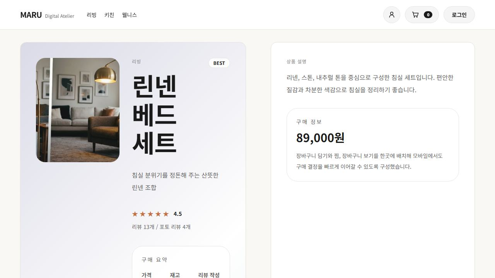

# Maru

Maru는 사용자 스토어프런트와 관리자 화면을 하나의 Next.js 앱에서 제공하고,
Spring Boot API가 뒤에서 주문, 카탈로그, 계정, 관리자 기능을 담당하는 커머스 모노레포입니다.

## 한눈에 보기

- 프런트엔드: `apps/storefront`
- 백엔드: `apps/api`
- 데이터베이스: PostgreSQL
- 검증: lint, typecheck, build, API 테스트, Playwright E2E

## 최근 반영 내용

- 관리자 화면은 대시보드와 운영 목록을 더 촘촘하게 정리해 한 화면에서 상태를 빠르게 읽도록 다듬었습니다.
- 데모와 검증 흐름은 `demo:start`, `demo:stop`, `qa:e2e` 스크립트 기준으로 맞춰 로컬 재현 경로를 단순화했습니다.
- 이번 점검에서는 tracked 소스를 `git show HEAD:<path>` 기준으로 다시 확인했고, README와 대표 문구 기준으로 남아 있는 한글 깨짐은 추가로 확인되지 않았습니다.

## 작업 메모

- 최근 작업의 중심은 기능 추가보다 데모/검증 하네스와 운영 화면의 읽기 흐름을 안정적으로 유지하는 쪽에 있었습니다.
- README는 실제 저장소에 포함된 최신 캡처 파일과 현재 실행 스크립트 기준으로 다시 맞췄습니다.

## 주요 화면

아래 이미지는 로컬에서 정상 연결 상태를 확인한 뒤, 1280 폭 기준으로 짧게 잘라 캡처한 화면입니다.

### 1. 메인 홈

첫 화면은 메인 배너와 카테고리 진입을 중심으로, 바로 탐색을 시작하게 만드는 구조입니다.


### 2. 검색 결과

검색어, 카테고리, 정렬을 한 화면에 묶어서 원하는 상품군을 빠르게 좁힐 수 있습니다.


### 3. 상품 상세

대표 상품 화면에서는 가격, 리뷰 밀도, 구매 요약이 한 번에 보이고 바로 장바구니로 이어집니다.



### 4. 체크아웃

체크아웃 화면은 배송 정보, 결제 수단, 최종 주문 요약을 한 흐름으로 묶어 결제 직전 확인 비용을 줄이는 방향으로 정리했습니다.


### 5. 관리자 진입

관리자 화면은 상품, 주문, 전시 운영을 분리된 작업 공간으로 다루는 구조입니다.


## 빠른 시작

### 1. 의존성 설치

```bash
npm ci
npm ci --prefix apps/storefront
```

### 2. 로컬 인프라 실행

```bash
npm run infra:up
```

### 3. 개발 서버 실행

```bash
npm run dev
```

기본 개발 주소:

- storefront: `http://127.0.0.1:3200`
- admin: `http://127.0.0.1:3200/admin`
- api: `http://127.0.0.1:8080`

개별 실행이 필요하면 아래 스크립트를 따로 사용할 수 있습니다.

```bash
npm run dev:api
npm run dev:storefront
```

### 4. 데모/캡처 스택 실행

```bash
npm run demo:start
```

README 캡처에 사용한 고정 주소:

- storefront: `http://127.0.0.1:4100`
- api health: `http://127.0.0.1:8180/actuator/health`

종료:

```bash
npm run demo:stop
```

## 검증 명령

```bash
npm run qa
npm run qa:e2e
```

브라우저를 직접 보면서 확인하려면 아래 명령도 사용할 수 있습니다.

```bash
npm run qa:e2e:headed
```

## 추가 문서

- `docs/api-contract-v1.md`
- `docs/erd-v1.md`
- `docs/design-system.md`
- `docs/demo/`
