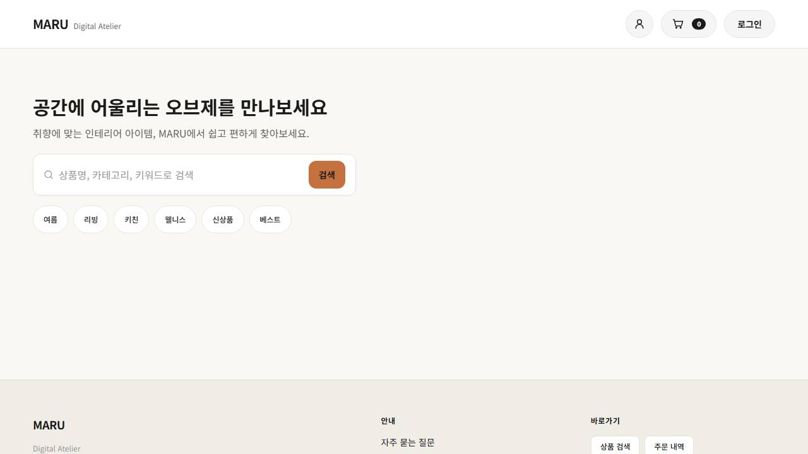
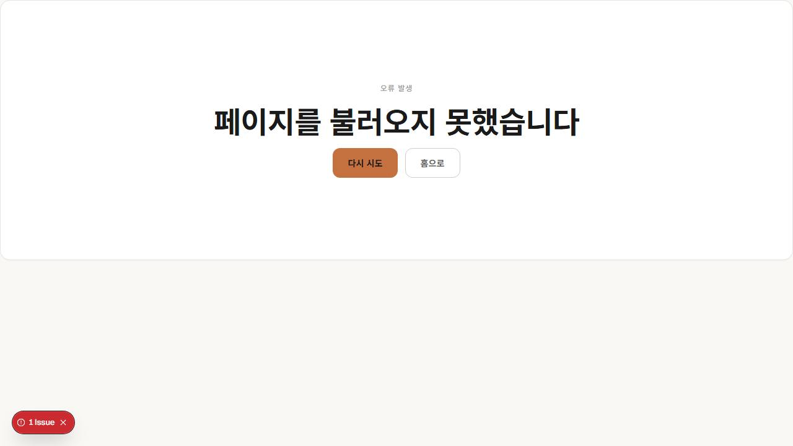
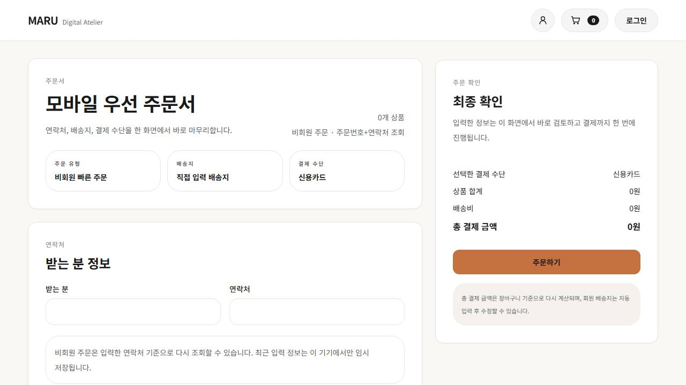
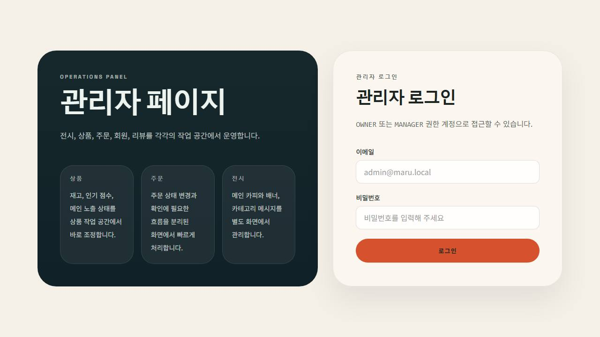

# Maru

Maru is a commerce monorepo with a single Next.js storefront/admin app and a Spring Boot API.
The current product shape is simple: customers browse and order on the storefront, and operators manage display, products, and orders from `/admin`.

## At A Glance

- Frontend: `apps/storefront` (`/` for storefront, `/admin` for admin)
- Backend: `apps/api`
- Database: PostgreSQL
- Tests: lint, typecheck, build, API tests, Playwright E2E

## Main Screens

These screenshots are intentionally cropped to a compact 1280-wide viewport so the README stays readable.

### 1. Storefront home

The home screen focuses on quick search and mood-based entry points.



### 2. Search and filtering

Search keeps the first decision simple: keyword, category, and sort options in one flow.



### 3. Mobile-first checkout

Checkout is condensed into a single page with recipient info on the left and the final order summary on the right.



### 4. Admin entry

The admin side is positioned as an operations panel for display, products, orders, members, and reviews.



## Quick Start

### Install

```bash
npm ci
npm ci --prefix apps/storefront
```

### Start local infra

```bash
npm run infra:up
```

### Run in dev mode

```bash
npm run dev:api
npm run dev:storefront
```

Typical local endpoints:

- storefront: `http://127.0.0.1:3200`
- admin: `http://127.0.0.1:3200/admin`
- api: `http://127.0.0.1:8080`

### Run the demo stack

```bash
node scripts/start-demo-stack.mjs
```

This starts the README/demo capture stack on fixed local URLs:

- storefront: `http://127.0.0.1:4100`
- api health: `http://127.0.0.1:8180/actuator/health`

Stop it with:

```bash
node scripts/stop-demo-stack.mjs
```

## Verification

```bash
npm run qa
npm run qa:e2e
```

`npm run qa` runs the main non-E2E verification path. `npm run qa:e2e` runs the browser suite with the local stack.

## More Docs

- `docs/api-contract-v1.md`
- `docs/erd-v1.md`
- `docs/design-system.md`
- `docs/demo/`
