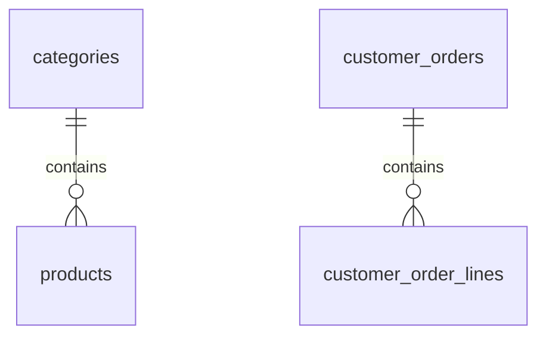

# ERD v1

현재 문서는 `V1__init_schema.sql` 기준의 실제 스키마만 요약한다. 레거시 SalesOn 물리 ERD 전체를 복제하지 않는다.

## 테이블

### `categories`

| 컬럼 | 타입 | 제약 | 설명 |
| --- | --- | --- | --- |
| `id` | `BIGINT` | PK | 카테고리 ID |
| `slug` | `VARCHAR(80)` | `NOT NULL`, `UNIQUE` | 라우트 slug |
| `name` | `VARCHAR(80)` | `NOT NULL` | 카테고리명 |
| `description` | `VARCHAR(255)` | `NOT NULL` | 전시 설명 |
| `accent_color` | `VARCHAR(20)` | `NOT NULL` | UI 강조 색상 |

### `products`

| 컬럼 | 타입 | 제약 | 설명 |
| --- | --- | --- | --- |
| `id` | `BIGINT` | PK | 상품 ID |
| `category_id` | `BIGINT` | FK -> `categories.id` | 소속 카테고리 |
| `slug` | `VARCHAR(120)` | `NOT NULL`, `UNIQUE` | 상품 slug |
| `name` | `VARCHAR(120)` | `NOT NULL` | 상품명 |
| `summary` | `VARCHAR(255)` | `NOT NULL` | 리스트용 요약 |
| `description` | `TEXT` | `NOT NULL` | 상세 설명 |
| `price` | `NUMERIC(12,0)` | `NOT NULL` | 판매가 |
| `badge` | `VARCHAR(50)` | `NOT NULL` | 전시 배지 |
| `accent_color` | `VARCHAR(20)` | `NOT NULL` | UI 강조 색상 |
| `featured` | `BOOLEAN` | `NOT NULL`, default `FALSE` | 홈 노출 여부 |
| `stock` | `INTEGER` | `NOT NULL`, default `0` | 현재 재고 |

### `customer_orders`

| 컬럼 | 타입 | 제약 | 설명 |
| --- | --- | --- | --- |
| `id` | `BIGINT` | PK | 주문 ID |
| `order_number` | `VARCHAR(30)` | `NOT NULL`, `UNIQUE` | 외부 노출 주문번호 |
| `customer_name` | `VARCHAR(80)` | `NOT NULL` | 수취인명 |
| `phone` | `VARCHAR(30)` | `NOT NULL` | 연락처 |
| `postal_code` | `VARCHAR(20)` | `NOT NULL` | 우편번호 |
| `address1` | `VARCHAR(255)` | `NOT NULL` | 기본 주소 |
| `address2` | `VARCHAR(255)` | `NOT NULL` | 상세 주소 |
| `note` | `VARCHAR(255)` | `NOT NULL` | 배송 메모 |
| `subtotal` | `NUMERIC(12,0)` | `NOT NULL` | 상품 합계 |
| `shipping_fee` | `NUMERIC(12,0)` | `NOT NULL` | 배송비 |
| `total` | `NUMERIC(12,0)` | `NOT NULL` | 총 결제 금액 |
| `created_at` | `TIMESTAMP WITH TIME ZONE` | `NOT NULL` | 생성 시각 |

### `customer_order_lines`

| 컬럼 | 타입 | 제약 | 설명 |
| --- | --- | --- | --- |
| `id` | `BIGINT` | PK | 주문 라인 ID |
| `order_id` | `BIGINT` | FK -> `customer_orders.id` | 주문 참조 |
| `product_id` | `BIGINT` | `NOT NULL` | 주문 시점 상품 ID |
| `product_name` | `VARCHAR(120)` | `NOT NULL` | 주문 시점 상품명 |
| `quantity` | `INTEGER` | `NOT NULL` | 수량 |
| `unit_price` | `NUMERIC(12,0)` | `NOT NULL` | 주문 시점 단가 |
| `line_total` | `NUMERIC(12,0)` | `NOT NULL` | 라인 합계 |

## 관계

## 현재 스키마 특징

- `products.stock`은 존재하지만 현재 주문 생성 시 차감되지 않는다.
- `customer_orders`에는 상태 컬럼이 아직 없다.
- 회원, 세션, 주소록, 쿠폰, 결제, 취소/반품/교환 테이블이 아직 없다.
- 서버 장바구니 테이블도 아직 없다.

## 다음 스키마 확장 우선순위

1. 회원/세션/게스트 주문 구분용 테이블
2. 서버 장바구니 및 cart item 테이블
3. 주문 상태, 결제 승인/실패, idempotency 키
4. 재고 예약 또는 재고 이력 테이블
5. 배송지, 주문 클레임, 쿠폰, 위시리스트
