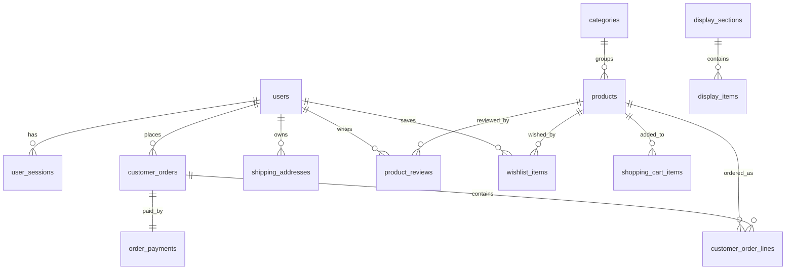

# ERD v1

Vibe Shop의 데이터 모델 개요 문서다.  
이 문서는 현재 Flyway 마이그레이션 기준의 **실제 물리 테이블** 과, 이를 읽기 쉽게 설명한 **도메인 관점 구조**를 함께 정리한다.

## 1. 도메인 개요

현재 스키마는 아래 도메인으로 구성된다.

- 사용자 / 인증 / 세션
- 카탈로그 / 전시
- 장바구니
- 주문 / 결제
- 계정 / 배송지
- 리뷰
- 위시리스트
- 관리자 운영

---

## 2. 사용자 / 인증 도메인

### 2.1 `users`

사용자 기본 엔티티다. 일반 회원과 관리자 계정을 동일 테이블에서 관리한다.

주요 컬럼:
- `id`
- `name`
- `email`
- `password_hash`
- `provider`
- `role`
- `status`
- `phone`
- `marketing_opt_in`
- `last_login_at`
- `created_at`

설명:
- `provider` 는 `LOCAL`, `GOOGLE`, `KAKAO` 등 로그인 방식을 구분한다.
- `role` 은 `CUSTOMER`, `MANAGER`, `OWNER` 등 운영 권한을 표현한다.
- `status` 는 회원 상태(`ACTIVE`, `DORMANT`, `BLOCKED` 등)를 표현한다.

### 2.2 `user_sessions`

세션 기반 인증 저장소다.

주요 컬럼:
- `id`
- `user_id`
- `session_token_hash`
- `created_at`
- `expires_at`

설명:
- 브라우저에는 raw session token이 `HttpOnly` 쿠키로 내려간다.
- 서버는 raw token 자체를 저장하지 않고 `session_token_hash` 로 조회한다.
- 고객 세션과 관리자 세션은 모두 동일한 세션 저장 구조를 사용하고, 접근 제어는 `users.role` 로 구분한다.

관계:
- `users 1 : N user_sessions`

---

## 3. 카탈로그 / 전시 도메인

### 3.1 `categories`

카테고리 기본 정보와 전시 메타데이터를 함께 가진다.

주요 컬럼:
- `id`
- `slug`
- `name`
- `description`
- `accent_color`
- `display_order`
- `is_visible`
- `cover_image_url`
- `cover_image_alt`
- `hero_title`
- `hero_subtitle`

### 3.2 `products`

상품 기본 엔티티다.

주요 컬럼:
- `id`
- `category_id`
- `slug`
- `name`
- `summary`
- `description`
- `price`
- `badge`
- `accent_color`
- `image_url`
- `image_alt`
- `featured`
- `stock`
- `popularity_score`
- `created_at`

설명:
- 목록 / 상세 / 홈 전시 / 관리자 상품 관리까지 동일 엔티티를 사용한다.
- 검색은 별도 search table 없이 `products` 조회 조건으로 처리한다.

### 3.3 `admin_display_settings`

홈 히어로 전시의 공통 설정을 저장한다.

주요 컬럼:
- `id`
- `hero_title`
- `hero_subtitle`
- `hero_cta_label`
- `hero_cta_href`
- `updated_at`

### 3.4 `display_sections`

홈 전시 섹션 단위 설정 테이블이다.

주요 컬럼:
- `id`
- `code`
- `title`
- `subtitle`
- `display_order`
- `is_visible`
- `updated_at`

### 3.5 `display_items`

전시 섹션에 속한 배너 / 프로모션 항목 테이블이다.

주요 컬럼:
- `id`
- `section_id`
- `title`
- `subtitle`
- `image_url`
- `image_alt`
- `href`
- `cta_label`
- `accent_color`
- `display_order`
- `is_visible`
- `starts_at`
- `ends_at`
- `updated_at`

관계:
- `categories 1 : N products`
- `display_sections 1 : N display_items`

---

## 4. 장바구니 도메인

### 4.1 논리 모델

도메인 관점에서는 다음처럼 읽을 수 있다.

- `cart` : 장바구니 헤더 역할
- `cart_item` : 장바구니 상세 항목

### 4.2 실제 물리 테이블: `shopping_cart_items`

현재 구현은 **별도 cart 헤더 테이블 없이** `shopping_cart_items` 하나로 관리한다.

주요 컬럼:
- `id`
- `session_token`
- `product_id`
- `quantity`
- `created_at`
- `updated_at`

설명:
- 비회원 장바구니는 `session_token` 기준으로 저장한다.
- 회원 장바구니도 별도 table 없이 `member:{userId}` 형태 키를 사용한다.
- 즉, 현재는 **logical cart / cart_item 구조를 단일 테이블로 단순화한 모델**이다.

관계:
- `products 1 : N shopping_cart_items`

---

## 5. 주문 / 결제 도메인

### 5.1 `customer_orders`

주문 헤더 테이블이다.

주요 컬럼:
- `id`
- `order_number`
- `idempotency_key`
- `customer_type`
- `user_id`
- `customer_name`
- `phone`
- `postal_code`
- `address1`
- `address2`
- `note`
- `subtotal`
- `shipping_fee`
- `total`
- `status`
- `created_at`

설명:
- `customer_type` 으로 회원 주문과 비회원 주문을 구분한다.
- `user_id` 는 회원 주문일 때만 연결된다.
- `idempotency_key` 로 중복 제출을 방지한다.

### 5.2 `customer_order_lines`

주문 상세 항목 테이블이다.

주요 컬럼:
- `id`
- `order_id`
- `product_id`
- `product_name`
- `quantity`
- `unit_price`
- `line_total`

### 5.3 `order_payments`

결제 상태를 저장하는 테이블이다.

주요 컬럼:
- `id`
- `order_id`
- `payment_method`
- `payment_status`
- `provider_code`
- `reference_code`
- `message`
- `approved_at`
- `created_at`
- `updated_at`

설명:
- 현재는 실제 PG 연동보다는 시뮬레이션 / 기본 흐름 저장 성격이 강하다.
- 주문당 결제는 현재 `UNIQUE(order_id)` 구조로 사실상 1:1 모델이다.

관계:
- `users 1 : N customer_orders`
- `customer_orders 1 : N customer_order_lines`
- `customer_orders 1 : 1 order_payments`
- `products 1 : N customer_order_lines`

---

## 6. 계정 / 배송지 도메인

### 6.1 `shipping_addresses`

회원 배송지 저장 테이블이다.

주요 컬럼:
- `id`
- `user_id`
- `label`
- `recipient_name`
- `phone`
- `postal_code`
- `address1`
- `address2`
- `is_default`
- `created_at`
- `updated_at`

관계:
- `users 1 : N shipping_addresses`

---

## 7. 리뷰 도메인

### 7.1 `product_reviews`

상품 리뷰 테이블이다.

주요 컬럼:
- `id`
- `product_id`
- `user_id`
- `rating`
- `title`
- `content`
- `status`
- `created_at`
- `updated_at`

설명:
- `product_reviews_unique_user_product` 제약으로 동일 사용자의 동일 상품 중복 리뷰를 방지한다.
- `status` 를 통해 `PUBLISHED`, `HIDDEN` 등 운영 상태를 관리한다.

관계:
- `users 1 : N product_reviews`
- `products 1 : N product_reviews`

---

## 8. 위시리스트 도메인

### 8.1 논리 모델

도메인 관점에서는 다음처럼 읽을 수 있다.

- `wishlist`
- `wishlist_item`

### 8.2 실제 물리 테이블: `wishlist_items`

현재는 별도 wishlist 헤더 없이 `wishlist_items` 단일 테이블로 표현한다.

주요 컬럼:
- `id`
- `user_id`
- `product_id`
- `created_at`

설명:
- 사용자별 위시리스트를 단일 매핑 테이블로 관리한다.
- `wishlist_items_unique_user_product` 제약으로 중복 찜을 막는다.

관계:
- `users 1 : N wishlist_items`
- `products 1 : N wishlist_items`

---

## 9. 관리자 / 운영 도메인

관리자 기능은 별도 `admins` 테이블이 아니라 `users.role` 기반으로 운영한다.

현재 관리자 관련 핵심 구조:
- 관리자 인증: `users` + `user_sessions`
- 전시 운영: `admin_display_settings`, `display_sections`, `display_items`
- 상품/주문/회원/리뷰 관리: 기존 도메인 테이블에 관리자 API가 접근

즉 현재 설계는 **운영자 계정을 별도 분리하지 않고, 공통 사용자 엔티티 위에 권한을 얹는 구조**다.

---

## 10. 관계 요약

---

## 11. 설계 메모

- 인증은 JWT 자체 검증형이 아니라 **세션 저장소 조회형 구조**다.
- 고객/관리자 모두 쿠키 기반 세션을 사용한다.
- 장바구니와 위시리스트는 현재 물리적으로 단순화된 테이블 구조를 쓴다.
- 장바구니는 비회원 세션과 회원 장바구니를 병합할 수 있도록 설계되어 있다.
- 주문/결제/운영 정책은 실서비스 수준으로 계속 확장 가능한 구조를 전제로 한다.

## 12. 향후 개선 방향

- cart / wishlist 헤더 테이블 분리 여부 재검토
- audit log / 관리자 작업 이력 / 운영 이벤트 테이블 추가
- 결제 시도 이력 / 환불 이력 / 배송 이력 테이블 확장
- 인덱스 / 제약조건 / 운영성 관점 문서화 보강
- Flyway 마이그레이션과 ERD 문서의 자동 동기화 체계 검토

---

현재 문서는 **수동 관리 중**이며, 향후 **자동 문서화 체계로 전환 예정**이다.
